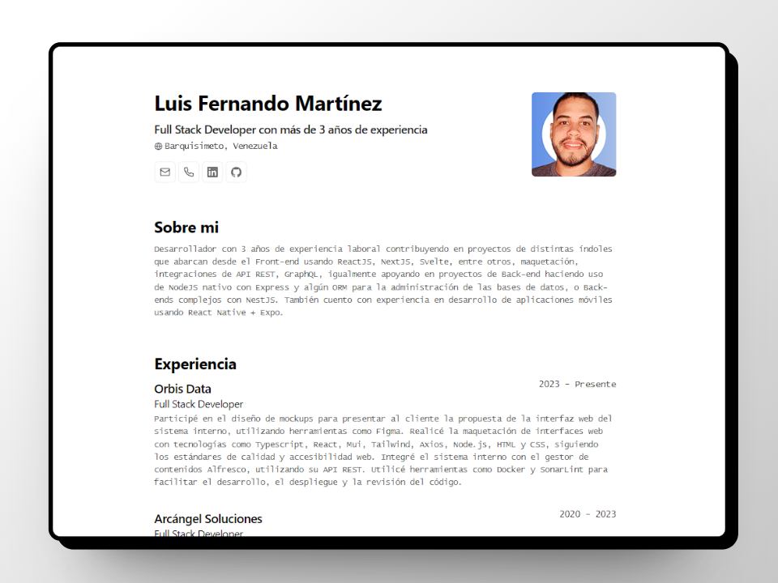

Mi CV Personal

## Descripción

Este proyecto es un CV personal que muestra información sobre mi formación académica, experiencia laboral y habilidades técnicas.

## Tecnologías utilizadas

- Astro

## Modificación

Para modificar los datos mostrados, modificar la información en el archivo `cv.json` que se encuentra en la raíz del proyecto.

## Créditos

- [Astro](https://astro.build/)
- [BartoszJarocki](https://github.com/BartoszJarocki/cv)
